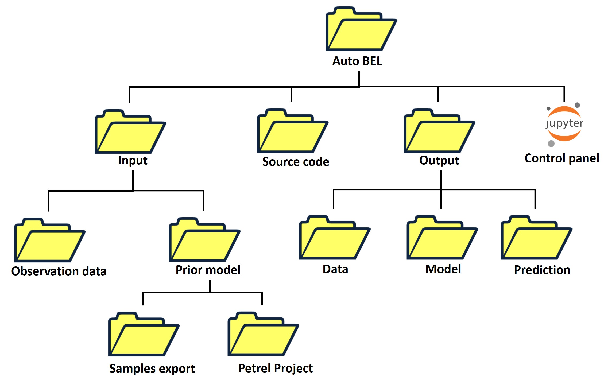

# Automated Bayesian Evidential Learning for Geological UQ 

This is companion code repository for 
* [Yin, Z., Strebelle, S., and Caers, J.: Automated Monte Carlo-based quantification and updating of geological uncertainty with borehole data (AutoBEL v1.0), Geosci. Model Dev., 13, 651–672](https://www.geosci-model-dev.net/13/651/2020/gmd-13-651-2020.html/)
	

 This repository contains the python code of automated BEL for geological model unceratinty quantification using well borehole data.

### Installation

To run the Auto-BEL, the following dependencies must be met:
* [Jupyter](http://jupyter.org/) 
* [Python 3.7](https://www.python.org/) 
* The above can be installed together via [Anaconda](https://www.anaconda.com/).

Once installed, jupyter can be started from the command line with

	jupyter notebook
	
### Structure of the Auto BEL setup

### Runing the Auto BEL

1. Download this repository to your PC
2. Start Jupyter notebook,
3. Navigate to the downloaded AutoBEL_Python master folder, 
4. Open the jupyter notebook file [Control_Pannel.ipynb](https://github.com/sdyinzhen/AutoBEL_Python/blob/master/Control_Pannel.ipynb), and follow the steps in the notebook to run BEL. 

### Tutorial Video
For illustration, a [tutorial video](https://youtu.be/9dP1jCvMOXo) is provided. 

### NB
The current AutoBEL tutorial is for uncertainty quantification of continous models. We are still working to make the catergoricial faices model data publicly available. However, all the codes for facies model management are provided in the repository, including signed distances calculations and back transform (“signed_distance_functions.py”), mixed PCA (“dmat_4mixpca.py”). The tutorial will be updated as soon as the facies model becomes available. 

### Licensing
This repository is released under the MIT License.
